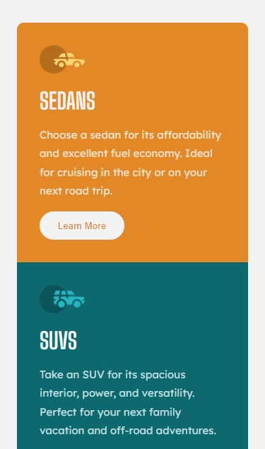
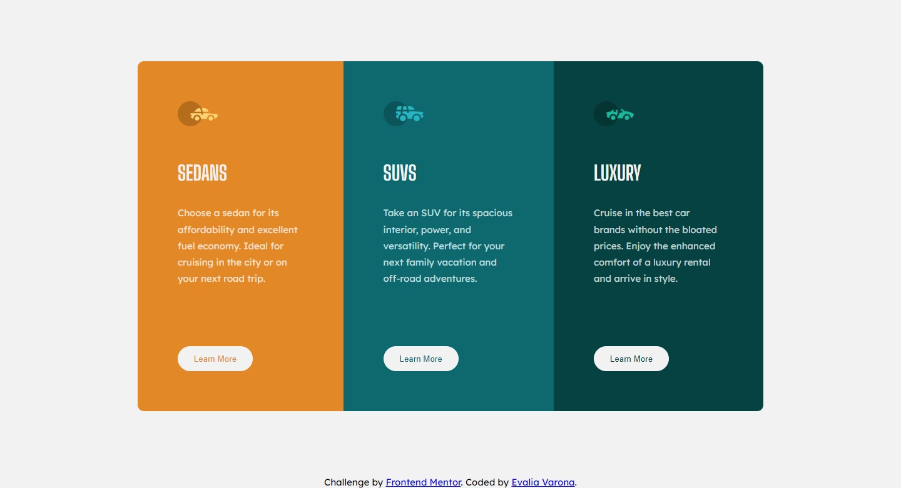

# Frontend Mentor - 3-column preview card component solution

This is a solution to the [3-column preview card component challenge on Frontend Mentor](https://www.frontendmentor.io/challenges/3column-preview-card-component-pH92eAR2-). Frontend Mentor challenges help you improve your coding skills by building realistic projects. 

## Table of contents

- [Frontend Mentor - 3-column preview card component solution](#frontend-mentor---3-column-preview-card-component-solution)
  - [Table of contents](#table-of-contents)
  - [Overview](#overview)
    - [The challenge](#the-challenge)
    - [Screenshot](#screenshot)
    - [Links](#links)
  - [My process](#my-process)
    - [Built with](#built-with)
    - [Continued development](#continued-development)
  - [Author](#author)

## Overview

### The challenge

Users should be able to:

- View the optimal layout depending on their device's screen size
- See hover states for interactive elements

### Screenshot

### Links

- Solution URL: [GitHub Repo](https://github.com/varonalearns/3-column-preview-card-component)
- Live Site URL: [Vercel Live Site](https://3-column-preview-card-component-delta-bice.vercel.app/)

## My process

### Built with

- Semantic HTML5 markup
- CSS custom properties
- Flexbox
- Mobile-first workflow

### Continued development

 I will continue to develop my CSS skills so that it gets easier and easier to implement complex asks without breaking much of a sweat.

## Author

- Website - [Evalia Varona](https://www.evaliavarona.com)
- Frontend Mentor - [@varonalearns](https://www.frontendmentor.io/profile/varonalearns)